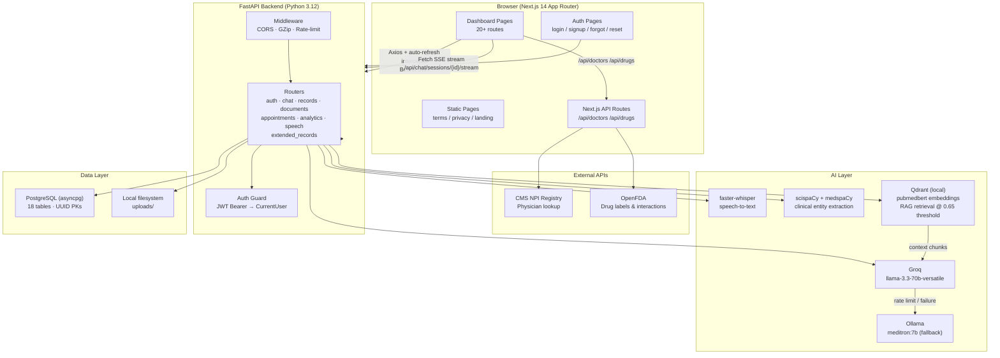
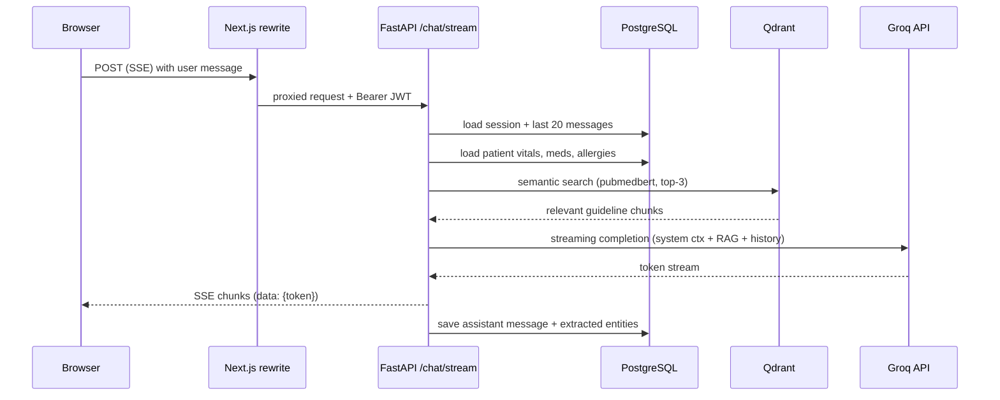
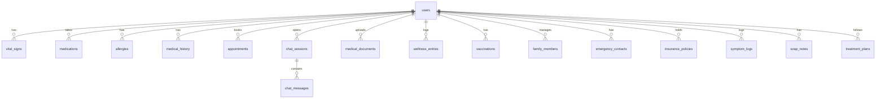

# Helixa AI-Native Healthcare Intelligence Platform

Helixa is a full-stack, production-grade health management platform that combines a longitudinal patient record, clinical-grade AI agents, and real-world data sources (FDA, NPI registry) into a single cohesive system. It is designed and built to the standard of a defensible, real-world healthcare product.

---

## What Makes Helixa Different

Most health apps are data silos. Helixa treats your health record as a **living knowledge graph** — every piece of data you add makes the AI smarter about you. When you open a chat session, the system automatically injects your current vitals, active medications, allergies, and conditions into the AI's context. When you upload a lab report, it's OCR'd, parsed by a clinical NLP pipeline, and the findings are linked back to your record.

Key architectural decisions that set it apart:

- **Three-tier AI fallback** — Groq (`llama-3.3-70b-versatile`) → Groq small model → Ollama (`meditron:7b`). Medical queries never fail silently.
- **RAG on PubMed embeddings** — A local Qdrant vector store, embedded with `pubmedbert-base-embeddings`, retrieves relevant medical guidelines at query time and injects them as context. Score threshold 0.65 ensures only high-quality context is used.
- **Clinical NLP stack** — scispaCy + medspaCy extract diseases, drugs, negations, and clinical sections from free text. Entity extraction runs on every AI chat response and every uploaded document.
- **React Query key factory** — All 25+ query keys are centralised in `queryKeys.ts`. Cache invalidation is type-safe and guaranteed to hit the right entries.
- **Auto-refresh JWT** — A single in-flight refresh promise is shared across concurrent 401s, preventing a thundering-herd of refresh calls.

---

## Feature Surface

| Area | Capabilities |
|---|---|
| **Health Record** | Vitals (BP, HR, glucose, SpO₂, temperature, weight), medications, allergies, medical history with ICD-10 codes |
| **AI Health Chat** | Streaming SSE responses, persistent sessions, health-context injection, RAG-augmented answers, voice input (Whisper) |
| **Analytics** | Vital trend charts (7–365 day range), computed health score (A–F grade with per-metric breakdown), AI-generated insight cards |
| **Documents** | Upload PDF/JPEG/PNG/TIFF medical records; background OCR pipeline; AI summary with key findings, medications found, urgency flags |
| **Appointments** | Schedule with doctor, auto-generate AI preparation notes from your health summary |
| **Pharmacy** | FDA drug label search, two-drug interaction checker (cross-references FDA warning text) |
| **Doctors** | Search 6M+ licensed physicians from the CMS NPI Registry by name, specialty, and state |
| **Wellness** | Log fitness, sleep, hydration, nutrition, stress, meditation; trend charts per category |
| **Clinical Tools** | SOAP notes, treatment plans, vaccination records, symptom logs (severity + triggers) |
| **Family & Contacts** | Family member health profiles (conditions, meds, allergies), emergency contacts, insurance policies |
| **Profile** | Blood group, gender, address, DOB, password change |
| **Auth** | Email/password signup, Google OAuth, forgot/reset password flow, JWT + httpOnly refresh cookie |

---

## Architecture



### Request lifecycle — AI chat message



---

## Tech Stack

### Backend
| Layer | Technology |
|---|---|
| Runtime | Python 3.12 |
| API Framework | FastAPI 0.115 + Uvicorn |
| Database | PostgreSQL 16 via SQLAlchemy 2.0 async (asyncpg) + Alembic |
| Auth | python-jose JWT · bcrypt (12 rounds) · httpOnly refresh cookie |
| AI Inference | Groq SDK → Ollama (`meditron:7b`) |
| Clinical NLP | spaCy 3.8 · scispaCy · medspaCy |
| Vector Search | Qdrant local · sentence-transformers (pubmedbert) |
| OCR | EasyOCR · pdfminer.six · pdf2image |
| Speech | faster-whisper (turbo, CPU int8) |
| Rate Limiting | slowapi (5/min auth, 10/min uploads) |
| Validation | Pydantic v2 · pydantic-settings |

### Frontend
| Layer | Technology |
|---|---|
| Framework | Next.js 14 (App Router) · React 18 · TypeScript 5 |
| Styling | Tailwind CSS 3 |
| Server State | TanStack React Query v5 |
| Client State | Zustand |
| UI Primitives | Radix UI |
| Animation | Framer Motion |
| Charts | Recharts |
| HTTP | Axios (auto-refresh interceptor) |
| Streaming | Native Fetch + ReadableStream (SSE) |
| Forms | react-hook-form + Zod |
| Icons | Lucide React |

---

## Project Structure

```
Helixa/
├── backend/
│   ├── app/
│   │   ├── core/           # Security (JWT, bcrypt), deps, rate limiter, exceptions
│   │   ├── models/         # SQLAlchemy ORM (User, VitalSign, Medication, Allergy,
│   │   │                   #   MedicalHistory, Appointment, ChatSession, ChatMessage,
│   │   │                   #   MedicalDocument + 8 extended record models)
│   │   ├── schemas/        # Pydantic request/response schemas
│   │   ├── routers/        # 8 route modules (auth, chat, records, documents,
│   │   │                   #   appointments, analytics, speech, extended_records)
│   │   ├── services/       # ai_service, nlp_service, rag_service, ocr_service,
│   │   │                   #   speech_service, medical_prompt
│   │   ├── config.py       # Pydantic settings (reads .env)
│   │   ├── database.py     # Async engine + session factory
│   │   └── main.py         # FastAPI app, middleware, lifespan
│   ├── alembic/            # Migration framework (auto-create on startup for dev)
│   ├── ingest/             # One-shot knowledge base ingestion (PDFs → Qdrant)
│   └── requirements.txt
│
├── frontend/
│   ├── app/
│   │   ├── (auth)/         # login, signup, forgot-password, reset-password
│   │   ├── (dashboard)/    # 20 authenticated pages behind sidebar layout
│   │   ├── api/            # Next.js server routes (NPI, OpenFDA — no CORS)
│   │   ├── terms/          # Static Terms of Service page
│   │   └── privacy/        # Static Privacy Policy page
│   ├── components/
│   │   └── layout/         # Sidebar (desktop collapse + mobile drawer)
│   ├── hooks/              # useAuth, useStreamChat
│   ├── store/              # Zustand auth store (sessionStorage persist)
│   ├── lib/                # Axios instance, queryKeys factory, utils
│   └── types/              # Shared TypeScript interfaces
│
├── .gitignore
└── README.md
```

---

## Getting Started

### Prerequisites
- Python 3.12+
- Node.js 20+
- PostgreSQL 16
- [Groq API key](https://console.groq.com) (free tier)
- Ollama (optional — only needed as AI fallback)

### Backend

```bash
cd backend
python -m venv .venv
source .venv/bin/activate        # Windows: .venv\Scripts\activate
pip install -r requirements.txt

# Copy and fill in your values
cp .env.example .env

uvicorn app.main:app --reload --port 8000
```

The app auto-creates all database tables on first startup via SQLAlchemy metadata.

#### Optional: populate the medical knowledge base

```bash
# Place PDF clinical guidelines in backend/data/
python ingest/ingest_knowledge.py
```

### Frontend

```bash
cd frontend
npm install
cp .env.local.example .env.local   # set NEXT_PUBLIC_API_URL=http://localhost:8000
npm run dev
```

Open [http://localhost:3000](http://localhost:3000).

---

## API Overview

All backend routes are prefixed with `/api`. The frontend proxies every `/api/*` call to the FastAPI server via Next.js rewrites — no CORS headers are needed in the browser.

| Prefix | Scope |
|---|---|
| `/api/auth` | signup, login, refresh, logout, me, forgot/reset password |
| `/api/chat` | sessions CRUD, SSE streaming AI chat |
| `/api/records` | vitals, medications, allergies, medical history, health summary |
| `/api/documents` | upload, OCR pipeline, AI summary, status polling |
| `/api/appointments` | scheduling, AI prep notes, status management |
| `/api/analytics` | vital trends, health score, AI insights |
| `/api/speech` | audio transcription (Whisper) |
| `/api/wellness` | fitness, sleep, hydration, nutrition, stress, meditation |
| `/api/vaccinations` | vaccination records |
| `/api/symptoms` | symptom logs with severity and triggers |
| `/api/soap-notes` | SOAP clinical notes with ICD-10 codes |
| `/api/treatment-plans` | treatment plans with goals and interventions |
| `/api/family` | family member health profiles |
| `/api/emergency-contacts` | emergency contact management |
| `/api/insurance` | insurance policy management |
| `/api/health` | health check |

Interactive API docs are available at `http://localhost:8000/docs` when the backend is running.

---

## Data Models

Helixa stores 18 tables under a single PostgreSQL database, all keyed by UUIDs with cascade-delete on the user foreign key.



---

## Security Design

- **Passwords** : bcrypt 12 rounds; enforced minimum complexity (letter + digit).
- **Tokens** : 15-minute access tokens (JSON body) + 7-day refresh tokens (`httpOnly`, `SameSite=strict` cookie scoped to `/api/auth`). Token type claim prevents cross-use between access and refresh tokens.
- **Auto-refresh** : Frontend Axios interceptor retries any 401 after refreshing once. A single in-flight promise prevents refresh storms from concurrent requests.
- **Rate limits** : 5 requests/min on all auth endpoints; 10/min on file uploads.
- **File uploads** : Magic-byte validation (first 16 bytes determine true file type, not client-supplied MIME). Streaming size check rejects files over the configured limit without buffering to disk first.
- **Password reset** : `secrets.token_urlsafe(32)` tokens, 1-hour expiry, cleared immediately on use.
- **CORS** : Explicit origin allowlist; credentials allowed only for listed origins.

---

## AI Safety

Every AI response includes a mandatory disclaimer appended by the system prompt. The medical prompt instructs the model to:

- Always escalate chest pain, stroke symptoms, or suicidal ideation to emergency services.
- Never suggest stopping prescribed medications.
- Cite uncertainty and recommend professional consultation.
- Distinguish clearly between informational content and medical advice.

---

*Helixa is a Innovative engineering work. It is not a licensed medical device and should not be used to make clinical decisions.*
